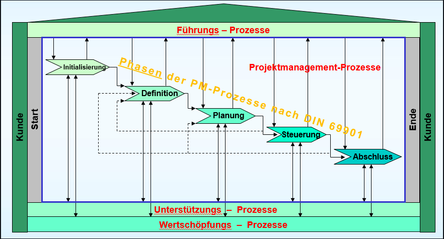

# **100er**

# Wieso Projekte? Warum werden immer mehr Aufgaben in Projektform abgewickelt?

- Mehr individuelle Problemlösungen
- Komplexität der Aufgaben steigt
- Abteilungsübergreifende Zusammenarbeit möglich
- Zusammenarbeit auch über Länder und Kontinentsgrenzen hinweg
- Interdisziplinär
- Mit Projektmanagement zur richtigen Problemsicht kommen.

# Was ist ein Projekt (Merkmale)?

- Zielorientierung: genaue inhaltliche Abgrenzung
- Zeitliche terminliche, finanzielle, personelle Begrenzung
- keine Routine, bis zu gewissen Grad einmalig
- Neuartig und Innovation
- Komplexität
- Zusammenarbbeit
- Interdisziplinär
- eigene organisatorische Zuordnung
- Bedeutung für das Unternehmen
- Risiko
- Umfang (Aufwand, Person, Finanzmittel)

Technisch gesehen: ein Projekt ist eine **Aufgabe (Vorhaben)**

- die sich aus einer Vielzahl von einzelnen **Teilaufgaben** (Tätigkeiten, Aktivitäten, Vorgänge) zusammensetzt (UMFANG)
- deren Erfüllung jeweils **Zeit** und andere **Ressourcen (Kapazitäten)** benötigt
- deren **Teilaufgaben** untereinander in **zeitlichen Anordnungsbeziehungen** stehen
- deren **organisatorische Bedürfnisse** sich im **Zeitablauf** ändern

# Nenne die drei Säulen von Projektmanagement

Projektmanagement besteht aus _Organisation_, _Mensch_ und _Methode_

# Was ist die Lehre aus dem Diagramm? (gehe dabei auch auf die Projektphasen ein) 

Mehraufwand von 5 % in der Anfangsphase führt zu Kosten- und Zeitvorteil von ca. 20 % beim Projektabschluss.

# Welche Ebenen des Projektmanagements kann man unterscheiden (Reichweite)

**PM "im Großen"**

- **übergeordnetes PM mit Sicht der Einbettung in die Systemumwelt bzw. in das Unternehmen**
- klassisches PM
- Orgformen "im Großen"
- "schwere" Prozesse
- "Wasserfall"

**PM "im Kleinen"**

- **Enge Sicht des PM: Nur der Erstellungsprozess des Produktes wird betrachtet**
- Focus: Systemerstellung
- agile Ansätze
- "Spiral-Modell"

# Welche Phasen hat das einfachste (Mehr-)Phasenmodell?

## a) beschreibe es

1. Initial Phase
2. Intermediate Phase
3. Final Phase

## b) baue es aus um weitere Phasen

1. Ideenphase
2. (Vorstudie)
3. Projektplanung
4. Projektdurchführung
5. Abschluss

# Welche Aufgaben bestehen in einem Projekt phasenübergreifend (sogenannte "Querschnittsaufgaben")?

- Kick-off, Teambildung (Projektplanung > Definition)
- Teamkommuikation, Reporting, Doku (Projektplanung + Projektdurchführung)
- Stakeholder-Analyse (Projektplanung + Projektdurchführung)
- Risikomanagement (Projektplanung + Projektdurchführung)
- Projekt-Controlling (Projektdurchführung)

# Welche Dokumente werden im Projektablauf gefordert?

- Projektantrag (Projektidee)
- Projektauftrag, Zieldefinition (Vorstudie)
- Meilensteinliste, Projektstrukturplan, Arbeitspakete, Netzplan (Projektplanung)
- Stakeholder-Analyse, Risikoanalyse (Projektplanung)
- Berichte zu jedem Meilenstein (Projekdurchführung)
- Projektabschlussbericht (Evaluierung)

# Welche grundlegenden Prozesse unterscheidet DIN 69901?

- Führungsprozesse
- Unterstützungsprozesse
- Wertschöpfungsprozesse

# Skizziere das Prozessmodell der DIN 69901

# Welche Prozessphasen sieht die DIN 69901 in Projektmanagement-Prozessen vor?

- Initalisierung
- Definition
- Planung
- Steuerung
- Abschluss

# Wozu Projektphasen?

- Reduzierung der Komplexität
- Schaffung von Entscheidungspunkten
- Möglichkeit zur Projektsteuerung
- Übersichtliche grafische Darstellung
- Ausgangsbasis für die Feinplanung

# Beschreibe die Vorgehensweise im „Unified Process“

1. Geschäftsprozessmodelierung
2. Anforderungen
3. Analyse und Entwurf
4. Umsetzung
5. Test
6. Auslieferung

# Wann ist (wann gilt) eine Projektphase (als) abgeschlossen?

Eine Phase ist erst dann abgeschlossen, wenn die in der Planung festgelegten Ergebnisse
(Dokumente, Programmfunktionen, Pläne, … ) in der geplanten Quantität und Qualität vorliegen und
abgenommen wurden

# Warum Projektmanagement? (Textfolie)

**Klare Kontrollmöglichkeiten bezüglich Ergebnissen, Terminen, Kosten und Produktivität**

- Verbessert Effizienz, Transparenz und Koordination aller Vorhaben

**Verbesserung der fachbereichsübergreifenden Zusammenarbeit**

- effizientere Nutzung von Ressourcen, hohe Motivation, besserer Informationsaustausch

**Konsequente Ausrichtung der vorhandenen Ressourcen**

- Verbessert damit auch die Ausrichtung auf die Unternehmensziele

**Förderung der Selbstorganisation, der Selbstkontrolle und der Eigenverantwortlichkeit von Mitarbeitern**

- Werden automatisch in den Linienalltag übernommen

**Projektmanagement als Basis für die Personalauswahl und für die Entwicklung zukünftiger Führungskräfte**

# Welche Projektarten kann man unterscheiden?

**Nach Auftraggeber**

- intern
- extern

# Welche grundlegenden Prozesse unterscheidet DIN 69901?

- Führungsprozesse
- Projektmanagementprozesse
- Unterstützungsprozesse
- Wertschöpfungsprozesse

**Nach Ziel**

- Sachziel(z.B Produktverbesserung)
- Prozessziel (z.B Ablaufverbesserung)

# Welche Prozessphasen sieht die DIN 69901 in Projektmanagement-Prozessen vor?

- Initialisierung
- Definition
- Planung
- Steuerung
- Abschluss

# Wozu Projektphasen?

Um die in der Planung festgelegten Ergebnisse (Dokumente, Programmfunktionen, Pläne, ...) in der geplanten Quantität und Qualität überprüfen zu können.

# Beschreibe die Vorgehensweise im „Unified Process“

Zuerst erfolgt die Geschäftsprozess-modellierung.

Danach werden die Anforderungen überprüft,
eine Analyse und einEntwurf wird erstellt,
eine Umsetzung bzw Implementation des Projektes,
Testen und anschließende Auslieferung(Deployement),
bei scheitern der Tests erfolgt eine Evaluierung

# Wann ist (wann gilt) eine Projektphase (als) abgeschlossen?

Eine Phase ist erst dann abgeschlossen, wenn die in der Planung festgelegten Ergebnisse (Dokumente, Programmfunktionen, Pläne, ...) in der geplanten Quantität und Qualität vorliegen und abgenommen wurden

# Warum Projektmanagement? (Textfolie)

    - Klare Kontrollmöglichkeiten
    - Konsequente Ausrichtung
    - Basis für Personalauswahl und Führungskraftauswahl
    - Verbesserung der fachsübergreifenden Zusammenarbeit
    - Förderung der Selbstorganisation und Selbstkontrolle

# Welche Projektarten kann man unterscheiden?

nach Auftraggeber

- intern
- extern

nach Ziel

- Sachziel → zb Produktverbesserung
- Prozessziel → Ablaufverbesserung

nach Häufigkeit

- repetitiv → ähnliche Grundstruktur
- nicht repetitiv → einmalig

nach relativer Neuartigkeit

- Wie bekannt ist der Zweck bzw. die Anwendung?
- Wie bekannt sind die Mittel- bzw Technologien

nach Aufgabengebiet (Projektinhalt)

- Investitionsprojekte
- Kundenauftragsprojekte
- Forschungs- und Entwicklungsprojekte
- Bauprojekte
- IT-Projekte
- Dienstleistungsprojekte
- usw.

Nach Projektorganisation / Befugnisse des Projektleiters

- Einflussprojekt
- Matrixprojekt
- Autonomes Projekt

Projektsteuerung

- Technokratisches Projekt
- Agiles Projekt

nach strategischen Aspekten

- Akzeptanzprojekte( komplexe Standardprojekte)
  - werden meist wiederholt (Wiederholcharakter)
  - unbekannte Personen
  - abteilungsübergreifende Zusammenarbeit
  - klare Aufgabenstellung
- Pionierprojekte
  - kein Wiederholcharakter
  - unbekannte Personen
  - alternative Lösungswege
  - abteilungs übergreifende Zusammenarbeit
- Potentialprojekte
  - kein Wiederholcharakter
  - bekannte Personen
  - alternative Lösungswege
  - innerhalb einer Abteilung
- Standard-/Routineprojekte
  - Wiederholcharakter
  - bekannte Personen
  - klare Aufgabenstellung
  - innerhalb einer Abteilung

# Welche Faktoren sind bei einem Innovationsprojekt besonders ausgeprägt?

- Zweck bzw. Anwendung
- Mittel bzw. Technik

Der Zweck bzw die Anwendung ist noch unbekannt und auch die Mittel bzw die Technik

# Wie werden Projekte nach relativer Neuigkeit eingeteilt?

- Wie (un)bekannt ist der Zweck bzw. die Anwendung?
- Wie (un)bekannt sind die Mittel bzw. Technologien?
- in Routine-Projekte, Fachprojekte, Innovationsprojekte

Nach repetitiver (ähnliche Grundstruktur) oder nicht repetitiver (einamliger) Form

# Wie können Projektarten nach dem Ziel des Projektes unterschieden werden?

- Sachziel(z.B Produktverbesserung)
- Prozessziel(z.B Ablaufverbesserung)

Nach Sachziel(zb. Produktverbesserung) und nach Prozessziel(zb. Ablaufverbesserung)

# Was zeichnet ein Potentialprojekt aus? (WELCHE Faktoren sind WIE ausgeprägt?)

**Fachlich-/inhaltliche Komplexität**

- ist sehr ausgeprägt(offen)

**Sozial-/kommunikative Komplexität**

- ist sehr ausgepägt(hoch)

Diese Projekte sind offen (alternative Lösungswege) und haben hohe Soziale-/kommunikative Komplexität (ateilungsübergreifende Zusammenarbeit)

# Was zeichnet ein Akzeptanzprojekt aus? (WELCHE Faktoren sind WIE ausgeprägt?)

**Fachlich-/inhaltliche Komplexität**

- ist wenig ausgeprägt(geschlossen)

**Sozial-/kommunikative Komplexität**

- ist sehr ausgepägt(hoch)

Wiederholcharakter, unbekannte Personen

Akzeptanzprojekte sind sozial und kommunikativ komplexe Projekte(abteilungsübergreifend) und Fachlich-/inhaltliv geschlossen (klare Aufgabenstellung)

# Was zeichnet ein Pionierprojekt aus? (WELCHE Faktoren sind WIE ausgeprägt?)

**Fachlich-/inhaltliche Komplexität**

- ist sehr ausgeprägt(offen)

**Sozial-/kommunikative Komplexität**

- ist sehr ausgepägt(hoch)

kein Wiederholcharakter, unbekannte Personen

# Was zeichnet ein Standardprojekt (Routineprojekt) aus? (WELCHE Faktoren sind WIE ausgeprägt?)

**Fachlich-/inhaltliche Komplexität**

- ist gering ausgeprägt(geschlossenn)

**Sozial-/kommunikative Komplexität**

- ist gering ausgepägt(gering)

Wiederholcharakter, bekannte Personen

# Welche Aufgabenträger sind in einem größeren Projekt neben dem/der Projektleiter\*in noch anzutreffen und welche Aufgaben haben bzw. welche Rolle spielen diese? (NICHT: Arten)

**Das Projektteam**

- Fachliche Kompetenz
- Teamfähigkeit
  - Kommunikations- und Integrationsfähigkeit
  - Konfliktfähigkeit
  - Verantwortungsbewusstsein, Sensibilität
  - Engagement und Entschlusskraft
  - Analytisches Denken und Ideenreichtum

**Der Projektausschuss**

- Ist Verbindungsglied zwischen Projekt- und Linienorganisation
- Besteht aus Vetretern der Unternehmensleitung und den betroffenen Abteilungsleitern
- Aufgaben:
  - Klare Zieldefinition
  - Steuerung des Projektforganges
  - Schlichten von Konflikten
  - Vetragsverhandlungen
  - Berufung des/der ProjektleiterIn
  - Abnahme von Ergebnissen

**Die Promotoren**

- Wichtig bei Großprojekten
- Bei weitreichenden Veränderungen
- Arten bzw. Aufgaben
  - Machtpromotoren
  - Beziehungs- oder Sozialpromotoren
  - Fachpromotoren

Promotoren „intervenieren“ im Interesse der Projektziel-Erreichung
Sie sollen insbesondere auf Stakeholder einwirken
Sie sind KEINE Projektmitarbeiter, sondern „unabhängige Dritte“

# Welche Eigenschaften muss ein(e) gute(r) Projektleiter\*in aufweisen?

- Überzeugung
- Durchsetzungsvermögen
- Belastbarkeit
- Zuverlässigkeit
- Verantwortungsbewusstsein
- Kontaktfähigkeit
- Teamgeist
- Kreativität
- Entscheidungfähigkeit
- Eigeninitiative
- Verhandlungskompetenz

# Welche Rollen muss ein(e) gute(r) Projektleiter\*in ausfüllen?

- Moderator
- Diplomat
- Manager
- Fachperson
- Prellbock
- Stratege
- Konfliktmanager
- Teamentwickler
- Diagnostiker
- Berater
- Lehrkraft
- Seelsorger

# Was sind die Aufgaben eines/einer Projektleiter\*in?

- Klärung der Zielvorgaben
- Festlegen der Aufbau- und Ablauforganisation
- Entscheidung über Lösungsalternativen
- Planen und Beschaffung von Ressourcen
- Vergabe von Aufgaben
- Koordination, Führung und Motivation
- Jederzeitigen Überblick über Projektstand

# Wozu dient ein Projektausschuss? (Rolle, Randbedingungen, Zusammensetzung, NICHT: Aufgaben)

- Ist Verbindungsglied zwischen Projekt- und Linienorganisation
- Besteht aus Vertretern der Unternehmensleitung und den betroffenen Abteilungsleitern

# Welche Aufgaben hat ein Projektausschuss?

- Klare Zieldefinition
- Steuerung des Projektfortganges
- Schlichten von Konflikten
- Vertragsverhandlungen
- Berufung des/der ProjektleiterIn
- Abnahme von Ergebnissen

# Was versteht man unter "Promotor"?

Promotoren intervenieren im Interesse der Projektziel-Erreichung  
Sie sollen insbesondere auf Stakeholder einwirken  
Sie sind **KEINE** Projektmitarbeiter, sondern "unabhängige Dritte"

## Wozu Promotoren?

- Sind wichtig bei Großprojekten
- Bei weitreichenden Veränderungen
- sollen insbesondere auf Stakeholder einwirken

## Welche Arten gibt es?

- Machtpromotoren (einflussreiche Person des öffentlichen Lebens)
- Beziehungs- oder Sozialpromotoren (Vertrauensleute, Netzwerker)
- Fachpromotoren (Unangreifbare, anerkannte Kompetenz, Koryphäe)

# Wozu Promotoren? Welche Arten gibt es?

- Sind wichtig bei Großprojekten
- Bei weitreichenden Veränderungen
- sollen insbesondere auf Stakeholder einwirken
- Machtpromotoren, Beziehungs- oder Sozialpromotoren, Fachpromotoren

# Beschreibe die Methode "Brainstorming"?

## Was ist das?

Eine Kreativitätstechnik

## Wie ist der Ablauf?

Ideensuchgruppe soll zu bekanntem Problem so viele Lösungsvorschläge wie möglich machen!

## Worauf ist zu achten?

- Etwa 7 Personen
- 10-20 Minuten
- Klare Problemdefinition
- Quantität zählt
- Jegliche Kritik während der Sitzung ist verboten!
- Keine Killerphrasen
- Vernunft und Logik sind _nicht_ gefragt!

# Beschreibe die „Methode 635“?

## Was ist das?

Eine Kreativiätstechnik

## Wie ist der Ablauf?

**6** Problemlöser schreiben je **3** Lösungsansätze auf Blatt Papier.  
Nach **5** Minuten werden die Blätter untereinander ausgetauscht.  
Aufbauend auf die am Blatt stehende Lösung bringt jeder wieder in 5 Minuten 3 Lösungen zu Papier.  
Das wird wiederholt bis alle 6 Blätter von
jedem der 6 Teilnehmer mit 3 Lösungsideen beschrieben sind.

## Worauf ist zu achten?

- Keine Kommunikation der Mitglieder der Ideensuchgruppe

# Was geschieht, wenn ein Projektteam die "Methode 635" anwendet? (ankreuzen)

- Gruppenspannungen wirken sich nicht auf kreative Produktion aus.
- Erfolgsrate liegt bei über 15%

# Beschreibe die Methode „Synektik“?

## Was ist das?

Eine Kreativitätstechnik

## Wie ist der Ablauf?

- Mache dir das Fremde vertraut = Gründliche Problemanalyse
- Entfremdedir das Vertraute: Durch Bildung von Analogien verfremden und für neue Problemstellungen nach Lösungen suchen (um den Hemmschuh "Erfahrung" zu entfernen)
- Die möglicherweise "utopischen" Lösungen wieder an die ursprüngliche Problemstellung ranführen

## Worauf ist zu achten?

# Beschreibe die Methode Morphologie?

## Was ist das?

Eine Kreativitätstechnik

## Wie ist der Ablauf?

- Problem wird in Bestandteile zerlegt
- Es werden andere Lösungsmöglichkeiten für jedes Bestandteil gesucht
- Lösungen des Gesamtproblems ergeben sich durch Kombination der einzelnen Bestandteils-Lösungen

## Worauf ist zu achten?

# Beschreibe die Methode Mindmapping?

## Was ist das?

Eine Kreativitätstechnik

## Wie ist der Ablauf?

- Problemstellung in die Blattmitte
- Problem in kleinere Bestandteile zerlegen, diese mithilfe von Pfeilen mit dem Hauptproblem und den anderen Unterproblemen verknüpfen
- Je nach Tiefe die kleineren Probleme in noch kleinere Probleme unterteilen

## Worauf ist zu achten?

**Mindmapping-Regeln**

- Beginn in Blattmitte
- Hauptthema und -äste in Blockbuchstaben
- geschwungene Äste, dünner werdend
- Länge der Linie = Länge des Begriffs
- je Linie darf nur ein Wort geschrieben werden
- verwende Farben und Zeichnungen/Symbole

**Die Mindmap darf nicht überladen werden**

# Beschreibe die Methode Bionik?

## Was ist das?

Eine Kreativitätstechnik

## Wie ist der Ablauf?

Problemstellungen werden an die Natur herangeführt (von der Natur lernen).
Man schaut sich Lösungen für Probleme, die in der Natur bereits gelöst sind, von der Natur ab.  
z.B.: Vögel -> Tragflächenenden "Winglets"

# Beschreibe die Methode Standard-Delphi?

## Was ist das?

Eine Kreativitätstechnik

## Wie ist der Ablauf?

- jedem Schätzer wird einzeln die Aufgabe erklärt
- Eventuell Schätzformular aushändigen
- Jeder füllt getrennt aus, keine Diskussion
- Sammlung der Schätzungen in einem Formular, jeweils mit Begründung
- Jedem einzeln: Vorlage der (aggregierten) Sammlung, und Überarbeitung
- In so vielen Schritten, bis die Einzelschätzungen sich ausreichend angenähert haben

## Worauf ist zu achten?

- keine Absprache zwischen den befragten Experten (keine Diskussion, schwer realisierbar)

# Was ist der Unterschied zwischen Standard- und Breitband Delphi?

Bei der Breitband-Delphi gibt es gemeinsame Sitzungen mit Diskussion am Beginn und zwischen den Runden

# Welche Ebenen gehören zu einem ganzheitlichen Projektmanagement?

- Sachebene (Fach-/Methodenkenntnisse)
- Organisatorische Ebene (PM-Kenntnisse)
- Psycho-soziale Ebene: Teamfähigkeit, Kommunikation

# Nenne allgemeine Spielregeln für erfolgreiche Kommunikation? (NICHT: Teamarbeit)

- Aktives Zuhören, Interesse am Gesprächspartner
- Killerphrasen vermeiden
- Rückmeldungen geben
- Ich-Botschaften verwenden

# Nenne allgemeine Spielregeln für erfolgreiche Teamarbeit? (NICHT: Kommunikation)

- Gemeinsam Spielregeln festlegen (Kick-Off)
- Vereinbartes Einhalten (Termine, Pünktlichkeit)
- jeder darf ausreden, aber kurz fassen
- Nachaußen dring nur, was die Gruppe genehmigt hat
- Dokuarbeit (Protokoll) und Moderation verteilt

# Was sind Serifen? Wo sollte man sie nicht verwenden?

Serifen sind die "Füßchen" bei Schriften wie Times New Roman, die für eine erhöhte Lesbarkeit geschaffen wurden.  
Man sollte sie nicht für Overhead- und Beamerprojektionen

# Welche unfaire Taktiken werden oft in Verhandlungen eingesetzt und wie begegnet man dem am besten?

- Partner argumentiert mit falschen Daten:
- - Interessiert zeigen und Daten vorlegen lassen, Quellen verlangen
- Partner tätigt persönliche Angriffe:
- - Ignorieren und auf Sachfrage bestehen
- Nachreichen von Forderungen:
- - Bitte, alle Wünsche bekannt zu geben - eigene Zusagen zurücknehmen
- Psychologische Tricks:
- - Warten lassen
- - - Nicht aus der Ruhe bringen lassen: z.B.: Fragen, ob man neuen Termin vereinbaren soll
- - Unguten Sitzplatz (Sonne blendet, es zieht, ...)
- - - Direkt ansprechen: "Darf ich Platz wechseln, ..."
- - Zeitdruck erzeugen (nur noch heute ...)
- - - Nicht aus der Ruhe bringen lassen: z.B.: um Reservierung bis morgen bitten

# **200er**

# Was ist ein Projektantrag?

Der Projektantrag enthält

- Ausformulierung der Projektidee
- Aufgabenbeschreibung
- Projektnutzen
- Folgen, wenn Projekt nicht gemacht wird
- personelle und finanzielle Rahmenbedingungen

außerdem löst der Projektantrag die Vorstudie aus.

Der Projektantrag ist die Voraussetzung und Grundlage zur Feststellung der Projektwürdigkeit und Durchführbarkeit.

# Was ist eine feasibility study? Wann erfolgt eine solche (zeitlich im Projektablauf)

Die feasibility study oder auch Machbarkeitsstudie ist eine Grundlage für die Entscheidung, ob und wie ein Projekt durchgeführt werden kann.

Sie erfolgt im frühen Stadium der Initialisierungsphase und sie ist in der Realisierungsphase bereits vollstädnig abgeschlossen.

# Worauf ist bei der Erarbeitung & Formulierung von Zielen zu achten?

Die visher vage Zielvorstellung soll

- systematisch strukturiert,
- auf Vollständigkeit überprüft und
- in eine verbindliche Form gebracht werden

# Was versteht man unter der Stoßrichtung eines Projektzieles?

* positive Entwicklung
* Bewahrung eines positiven Zustands 
* Vermeidung einer negativen Entwicklung

# Was ist das Teufelsquadrat? Aussage? Sinn?

An den Ecken des Teufelsquadrat stehen Qualität, Quantität, Kosten und Entwicklungsdauer. Zwischen den Ecken kann man sich eine Schnur bestimmter Länge vorstellen. Wenn man einen Faktor wenn man an einer Ecke des Quadrates zieht, verschieben sich auch die anderen Faktoren. Vor Projektbeginn muss geklärt werden, welches „Gewicht“ jede Dimension des Teufelsquadrates hat.

# Welche 4 Dimensionen enthält ein gut formuliertes Ziel jedenfalls?

> Wos moant der Spost?!

Ein gut formuliertes Ziel besteht aus Hinterfragen der folgenden Fragen:

- Wozu?
- Für wen?
- Was? (Endergebnis)
- Woran messbar?

# Eine „Eselsbrücke“ zum Überprüfen der Zielformulierung lautet SMART? Was verbirgt sich dahinter?

Hinter _SMART_ verbergen sich die folgenden Adjektive:

- **S**mart
- **M**easurable
- **A**chievable
- **R**elevant
- **T**ime phased

# Eine „Eselsbrücke“ zum Überprüfen der Zielformulierung lautet PURE? Was verbirgt sich dahinter?

Hinter _PURE_ verbergen sich die folgenden Adjektive:

- **P**ositively Stated (positiv formuliert)
- **U**nderstood (verständlich)
- **R**elevant
- **E**thical (ethisch korrekt)

# Eine „Eselsbrücke“ zum Überprüfen der Zielformulierung lautet CLEAR? Was verbirgt sich dahinter?

Hinter _CLEAR_ verbergen sich die folgenden Adjektive:

- **C**hallenging (herausfordernd)
- **L**egal (legal, rechtskonform)
- **E**nvironmentally Sound (umweltverträglich)
- **A**greed(vereinabrt, akzeptiert)
- **R**ecorded

# Beschreibe den Ablauf einer Nutzwertanalyse.

Zuerst wird das Zielsystem mithilfe der Sensitivitätsanalyse festgelegt.

Danach erfolgt die Ermittlung der Zielertragsmatrix (Erträge der Kriterien bezücglich der Handlungsalternativen)

Ermitteln der Zielwerte (Zielwertmatrix - skalierte Werte bezüglich der Zielerträge)
Wertsynthese (Nutzwertmatrix)
Kosten/Nutzen Bewertung
Andwendung der Entscheidungsregel

1. Zieldefinition
2. Ausschluss- und Auswahlkriterien definieren
3. Gewichtung der Kriterien
4. Definition von Alternativen
5. Bewerten von Alternativen
6. Nutzwertberechnung
7. Sensitivitätsanalyse

# Warum Nutzwertanalyse (Problemsituation, die für die Anwendung einer NWA spricht)?

- Viele Kriterien
- Viele Mitreder/Mitentscheider
- Verschiedene Personenen haben verschiedene Bedürfnisse/Anforderungen

# Wozu dient der Paarvergleich (im Rahmen der Nutzwertanalyse) und wie wird dieser durchgeführt?

Der Paarvergleich wird dazu verwendet herauszufinden welches Kriterium die höchste Gewichtung hat.
Beim Paarvergleich wird jeder Fall mit einem anderen Fall verglichen.

# Was geschieht bei der Sensitivitätsanalyse (im Rahmen einer Nutzwertanalyse)?

Die Sensitivitätsanalyse zeigt die Veränderung des Gesamtnutzens, wenn einzelne Parameter verändert werden (Beurteilung des Entscheidungsrisikos)

# Nenne die Vor- und Nachteile der Nutzwertanalyse

## Vorteile

- Hohe Transparenz der Entscheidungsfindung (konsistente Präferenzordnung)
- Trennung subjektiver Einschätzungen und objektiver Tatbestände
- Auch anwendbar, wenn mehrere Entscheidungsträger am Auswahlprozess beteilgt sind

## Nachteile

- Wegen der Subjektivität der Kriteriengewichte und der Berechnung der Zielerträge kann "Scheinobjektivität" vorgetäuscht werden
- Es ist ein relativer Verlgeich von Alternativen

# Wie kann eine Abgrenzung eines Projektes zum Umfeld geschehen (Sichten)?

aus inhaltlicher Sicht: Was ist Gegenstand, was nicht

- sachlich: Ziele und Inhalte
- zeitlich: Anfangs- und End- Ereignis
- sozial: Rollen und Werte

aus Beziehungssicht: Außenbeziehungen des Projekts
||||
| :- |-:| -:|
| sachlich | zu| anderen Projekten|
| zeitlich |zum | zum Unternehmen |
| sozial | zur | zur Unternehmensumwelt |

# Kennzeichne (durch umkreisen von ) w (wahr), f (falsch)

>  = ist Teilmenge von, pdU = das Unternehmen, dass das Projekt durchführt

## a) w – f Alle Stakeholder  aller Shareholder des pdU

## b) w – f Alle Shareholder des pdU  aller Stakeholder

## c) w – f Ein Stakeholder = Shareholder des pdU

## d) w – f Ein Shareholder des pdU = Stakeholder

---

# Kennzeichne (durch umkreisen von ) w (wahr), f (falsch)

>  = ist Teilmenge von, pdU = das Unternehmen, dass das Projekt durchführt

## a) **w** – f Alle Shareholder des pdU  aller Stakeholder

## b) w – **f** Alle Stakeholder  aller Shareholder des pdU

## c) w – **f** Ein Stakeholder = Shareholder des pdU

## d) **w** – f Ein Shareholder des pdU = Stakeholder

---

# Kennzeichne (durch umkreisen von ) w (wahr), f (falsch) 
> = ist Teilmenge von, pdU = das Unternehmen, dass das Projekt durchführt

## a) w – **f** Alle Stakeholder  aller Shareholder des pdU

## b) **w** – f Ein Shareholder des pdU = Stakeholder

## c) **w** – f Alle Shareholder des pdU  aller Stakeholder

## d) w – **f** Ein Stakeholder = Shareholder des pdU

---

# Kennzeichne (durch umkreisen von ) w (wahr), f (falsch) 
> = ist Teilmenge von, pdU = das Unternehmen, dass das Projekt durchführt

## a) w – **f** Alle Stakeholder  aller Shareholder des pdU

## b) w – **f** Ein Stakeholder = Shareholder des pdU

## c) **w** – f Alle Shareholder des pdU  aller Stakeholder

## d) **w** – f Ein Shareholder des pdU = Stakeholder

# Was bedeutet "Stakeholder"? Wie wird bei der Stakeholderanalyse vorgegangen?

Stakeholder sind Personen die in irgendeiner Weise am Projekt interessiert sind bze betroffen sind. 

Stakeholderanalyse:
1. identifiziere Stakeholder
2. sammle Informationen
3. antizipiere Verhalten ("antizpieren = vorwegnehmen", "ahne voraus")
4. verhindere negatives Verhalten durch Kommunikation

# Was **IST** ein Projektauftrag? (Inhalt ist NICHT gefragt, auch nicht grob!) Projektauftrag: NICHT: Was ist ein Projektauftrag , sondern:

## a) Wann im Zeitablauf?
I glaub Vorstudie was oba ned genau

## b) Was gehört in Projektauftrag (Inhalt grob und fein)?

 Er enthält (grob):
 - Zielformulierung
 - Qualitätskriterien
 - finanzieller Rahmen
 - Termine
 - Organisation und Personen

Er enthält (fein):
- Projektbezeichnung
- Auftraggeber
- Ziel
- Kurzbeschreibung("Aufriss")
- Projektstart (Wie?)
- Projektende (zB Abnahme von ...)
- Freigaben (wann muss fur "go" ok eingeholt werden)
- Ressourcen
- Projektleiter
- Team
- Vertragsabschluss-Personen

# **300er**
# Zähle möglichst vollständig die Bausteine einer guten Projektkultur auf
* Projekt-Ziele
* Aufbau-Organisation
* Ablauf-Organisation
* Projekt-planung
* Führung
* Projekt-controlling

# Was gehört alles zu einer guten Projektkultur? Was muss dafür getan werden? Was bekommt man dafür (Nutzen)?
Ensteht durch Haltungen, Denkweisen, die der Förderung von Motivation, Engagement und Teamgeist dienen.
Projektkultur ist und schafft das Klima für
* Verbesserung der Kooperation
* Verbesserung der fachlichen sozialen Kompetenz
* Eine Steigerung der Kreativität

Ergebnis: 
Verringerung des Projektrisikos

> Wola bin ma ned sicha ob des stimmt oba do steht ois so scheiße
# Warum ist ein motivierender Projektstart so wichtig? 
Der Projektstart ist wie der erste Schultag: Man spürt gleich, ob man sich in dieser Gruppe wohl fühlen wird oder nicht. 
Und vom „Wohlfühlen“ hängt vielfach auch der Erfolg des gesamten Projektes ab.
Wichtig daher: Gute Projektkultur zeigt sich bereits am Projektstart​
> Digga steht scho wieda ned gscheid drinne wird scho passen ka
# Welche Formen haben wir kennen gelernt (Aufzählung)?
* Start-Up-Seminar
* Start-Up-Workshop
* Kick-Off-Meeting
# Beschreibe ein Projekt-Start-up-Workshop
oft mehrtägig, außerhalb der Firma

zu den im Start-Up-Seminar behandelten Aufgaben
* Geschichte, Ziele und Umfeld des Projektes
* Unklarheiten werden beseitigt
* Ziele konkretisiert
* Probleme und Risiken besprochen

kommen noch dazu: 
* Klimaaufbau, "Wir-Gefühl" herstellen
* Konfliktquellen frühzeitig erkennen ("Rankkämpfe")
* Zielausrichtung -> Konzentration auf Projekt
* gemeinsame Projektplanung (grob: Abgrenzung, Strukturierung, Ressourcen, ..)
* Rollen / Verantwortung definieren
* Kommunikationswege festlegen

am besten auch von einem externen Moderator/Berater geleitet
# Beschreibe ein Projekt-Kick-Off. Was ist das, Ziele, Ablauf. 
**Was ist das**
* Erste offizielle Sitzung des Teams nach Erteilung des Durchführungsauftrages
* Die an der Projektdurchführung beteiligten Personen lernen sich kennen und werden informiert

**Ziele**
* Klimabildung, Kennen lernen
* Erwartungen, Hoffnungen, Wünsche gegenseitig darlegen und klären
* Rollen klären
* Spielregeln für Zusammenarbeit (Protokoll, Moderation, Pünktlichkeit, Folgen: Kaffekassen füllen ....)

**Ablauf**
1. Pl eröffnet, stellt sich vor, legt Kompetenz offen
2. PL stellt Projektziel vor
3. Jedes Teammitglied stellt sich vor, schildert Erfahrungen, Wünsche und Befürchtungen
4. Pl informiert über weitere Details des Auftrages, geht auf Wünsche und Befürchtungen ein
5. Gemeinsam Spielregeln beschließen
6. Weitere Vorgehensweise vereinbaren
# Was versteht man unter informeller Organisation?
Informelle Organisationen sind soziale Strukturen, bei denenzwischenmenschliche Beziehungen eine große Rolle spielen. Sie werden durch soziale Kontakte und Sympathien zwischenden Mitgliedern gebildet und entstehen spontan.
> Hob i aus Internet i find ned auf Folien

# Nenne die 6 Grundformen von Projektorganisation
* Einfluss-Projektorganisation
* Matrix-Projektorganisation
* Auftrags-Projektorganisation
* Reine Projektorganisation
* projektorierentierte Teilorganisation
* projektorierentiertes Unternehmen

# Nenne Vor- und Nachteile der Einfluss-Projektorganisation 
**Vorteile**
* Besteh. Org. braucht nicht verändert werden
* Personalzuordnung zu mehreren Projekten möglich

**Nachteile**
* Projektleiter keine Weisungsbefugnis
* Keine Verantwortung des PL
* Wenig Verbindendes (Team)
* Kommunikation mit Auftraggeber

# Nenne Vor- und Nachteile der Matrix-Projektorganisation im Vergleich zu anderen Formen. 

## Vorteile:
  Identifaktion der Projektmitglieder (Team)
  Keine (Re)Integrationsprobleme bei Projektende

## Nachteile:
  Konfliktpotential (Projekt-Linie)
  Doppelunterstellung("zwei Herren")

# Beschreibe die Org.-Form „Auftrags-Projektorganisation“. 

Die Auftrags-Projektorganisation ist zwar Matrixorientiert hat aber keine Doppelunterstellung. Sie hat eine eigene Organisationseinheit: "Projektmanagement" und ist für Unternehmen mit vielen Projekten. Der Projektleiter hat die Gesamtverantwortung und grundsätzlich ist die setzt sich die Auftrags-Projektorganisation aus kleine Projektgruppen(z.B. "Lieferant" ) zusammen. 

> Beispiel: Von der Motoren-Divison von VW kommt der Auftrag an die als Auftrags-PO aufgestellte Forschungsabteilung: „Entwickeln sie eine neue, Abgas-reduziernde Motorensteuerung“. Die Forschungs-Abteilung übernimmt den Auftrag und steuert die Entwicklung. Sie vergibt selbst wieder Aufträge an die Fachabteilungen (Elektronik, IT). Gemanagt wird das Projekt aber von der Forschungsabteilung (analog Bild: „Proj. A“)

# a) Beschreibe die Org.-Form „Reine Projektorganisation“.  
 
  Bie einer reinen Projektorganisation werden die Mitarbeiter vollstündig aus ihren üblichen Unternehmensbereichen ausgegliedert und in das Projekt eingebunden. Sie eignet sich besonders gut für umfangreiche, komplexe Projekte von hoher Bedeutung. 
  Die Verantwortungsbereiche und die Aufgabenverteilung ist klar strukturiert.

# b) Wie nennt man diese noch?      

  Die "reine Projektorganisation" nennt man außerdem noch "Task Force".

# c) Vor-/Nachteile 
  <!-- |Vorteile |Nachteile |
  |--|--|
  |PL hat volle Kompetenz | Wiedereingliederung nach Projektende|
  |Optimale Ausrichtung auf das Projektziel| Wer wird abgestellt(Qualif.)|
  |Geringster Overhead | |
  |Volle Identifikation(Motivation) | | -->

## Vorteile
* PL hat volle Kompetenz
* Optimale Ausrichtung auf das Projektziel
* Geringster Overhead
* Volle Identifikation (Motivation)

## Nachteile
* Wiedereingliederung nach Projektende
* Wer wird abgestellt (Qualif.)

# Beschreibe die Organisationsform „projektorientiertes Unternehmen“. (Wie ist so eine Form aufgebaut? Wie ist der Arbeitsablauf? Wie werden die Projekte koordiniert usw.)

Wenn Projekte "zum Normalfall" werden wird die Projektorganisation immer mehr auch zur Unternehmensorgainsation.
Jeder im Führungskreis ist für ein Projekt zuständig. Jeder Arbeiter ist einem Projekt zugeteilt. Dienstleistungsservice (Administration, Verwaltung (z.B. EDV, Personal, …)) wird für alle Projekte zur Verfügung gestellt. 

# Wähle eine Projekt-Organisationsform und begründe* deine Wahl: Sehr umfangreiches Projekt, wenig Risiko, bekannte Technologie, durchschnittlicher Zeitdruck, Plandauer ist 2 Jahre. (Annahme: es wurden/werden nur wenige Projekte im Unternehmen gemacht) 
> *Nenne Aspekte, die für die eine oder andere Form sprechen.

# Wähle eine Projekt-Organisationsform und begründe* deine Wahl:Projektgröße mittel, hohes Risiko, bekannte Technologie, hoher Zeitdruck, Plandauer 7 Monate. (Annahme: es wurden/werden nicht sehr viele Projekte im Unternehmen gemacht)
> *Nenne Aspekte, die für die eine oder andere Form sprechen.

# Wähle eine Projekt-Organisationsform und begründe* deine Wahl: Projektgröße klein, hohes Risiko, bekannte Technologie, sehr hoher Zeitdruck, Plandauer 2 Monate. (Annahme: es wurden/werden nur wenige Projekte im Unternehmen gemacht)
> *Nenne Aspekte, die für die eine oder andere Form sprechen.

# Wähle eine Projekt-Organisationsform und begründe* deine Wahl: Projektgröße klein, mittleres Risiko, unbekannte Technologie, sehr hoher Zeitdruck, Plandauer 12 Monate. (Annahme: es wurden/werden nur wenige Projekte im Unternehmen gemacht)
> Nenne Aspekte, die für die eine oder andere Form sprechen.

# Beschreibe die Organisationsform „Chefprogrammierer-Team“ (Charakteristika, Vor-, Nachteile)

# a) Was grenzt die Organisationsform „Projektgruppe“ vom „Chefprogrammierer-Team“ ab?       b) Vor- /Nachteile?

# Beschreibe die 4 (bzw. 5) Phasen der Teambildung

# Was unterscheidet Produktstruktur, Objektstruktur und Projektstruktur?

# Wie lautet die englische Bezeichnung für Projektstrukturplan?

# Im Projektstrukturplan wird das Projekt tätigkeitsmäßig und zeitlich gegliedert:    wahr  /  falsch  
