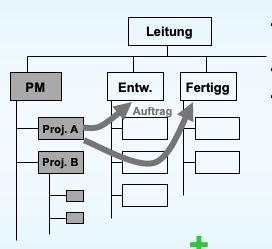

# **300er**

# Zähle möglichst vollständig die Bausteine einer guten Projektkultur auf
* Projektziele
* Aufbauorganisation
* Ablauforganisation
* Projektplanung
* Führung
* Projekt-Controlling

# Was gehört alles zu einer guten Projektkultur? Was muss dafür getan werden? Was bekommt man dafür (Nutzen)?

Die Projektkultur ist das Umfeld, die Art und Weise wie Methoden, Management usw. mit Menschen verbunden werden

Ensteht durch Haltungen, Denkweisen, die der Förderung von Motivation, Engagement und Teamgeist dienen.  
  
Projektkultur ist und schafft das Klima für
* Verbesserung der Kooperation
* Verbesserung der fachlichen sozialen Kompetenz
* Eine Steigerung der Kreativität

Ergebnis: 
Verringerung des Projektrisikos

# Warum ist ein motivierender Projektstart so wichtig?

Der Projektstart ist wie der erste Schultag: Man spürt gleich, ob man sich in dieser Gruppe wohl fühlen wird oder nicht. 
Und vom „Wohlfühlen“ hängt vielfach auch der Erfolg des gesamten Projektes ab.
Wichtig daher: Gute Projektkultur zeigt sich bereits am Projektstart​

## Welche Formen haben wir kennen gelernt (Aufzählung)?

* Start-Up-Seminar
* Start-Up-Workshop
* Kick-Off-Meeting

# Beschreibe ein Projekt-Start-up-Workshop

oft mehrtägig, außerhalb der Firma

zu den im Start-Up-Seminar behandelten Aufgaben
* Geschichte, Ziele und Umfeld des Projektes
* Unklarheiten werden beseitigt
* Ziele konkretisiert
* Probleme und Risiken besprochen

kommen noch dazu: 
* Klimaaufbau, "Wir-Gefühl" herstellen
* Konfliktquellen frühzeitig erkennen ("Rankkämpfe")
* Zielausrichtung -> Konzentration auf Projekt
* gemeinsame Projektplanung (grob: Abgrenzung, Strukturierung, Ressourcen, ..)
* Rollen / Verantwortung definieren
* Kommunikationswege festlegen

am besten auch von einem externen Moderator/Berater geleitet

# Beschreibe ein Projekt-Kick-Off. Was ist das, Ziele, Ablauf. 
**Was ist das**
* Erste offizielle Sitzung des Teams nach Erteilung des Durchführungsauftrages
* Die an der Projektdurchführung beteiligten Personen lernen sich kennen und werden informiert

**Ziele**
* Klimabildung, Kennen lernen
* Erwartungen, Hoffnungen, Wünsche gegenseitig darlegen und klären
* Rollen klären
* Spielregeln für Zusammenarbeit (Protokoll, Moderation, Pünktlichkeit, Folgen: Kaffekassen füllen ....)

**Ablauf**
1. Pl eröffnet, stellt sich vor, legt Kompetenz offen
2. PL stellt Projektziel vor
3. Jedes Teammitglied stellt sich vor, schildert Erfahrungen, Wünsche und Befürchtungen
4. Pl informiert über weitere Details des Auftrages, geht auf Wünsche und Befürchtungen ein
5. Gemeinsam Spielregeln beschließen
6. Weitere Vorgehensweise vereinbaren
# Was versteht man unter informeller Organisation?
Informelle Organisationen sind soziale Strukturen, bei denenzwischenmenschliche Beziehungen eine große Rolle spielen. Sie werden durch soziale Kontakte und Sympathien zwischenden Mitgliedern gebildet und entstehen spontan.
> Hob i aus Internet i find ned auf Folien

# Nenne die 6 Grundformen von Projektorganisation
* Einfluss-Projektorganisation
* Matrix-Projektorganisation
* Auftrags-Projektorganisation
* Reine Projektorganisation
* projektorierentierte Teilorganisation
* projektorierentiertes Unternehmen

# Nenne Vor- und Nachteile der Einfluss-Projektorganisation 
**Vorteile**
* Besteh. Org. braucht nicht verändert werden
* Personalzuordnung zu mehreren Projekten möglich

**Nachteile**
* Projektleiter keine Weisungsbefugnis
* Keine Verantwortung des PL
* Wenig Verbindendes (Team)
* Kommunikation mit Auftraggeber

# Nenne Vor- und Nachteile der Matrix-Projektorganisation im Vergleich zu anderen Formen. 

**Vorteile**  
  Identifaktion der Projektmitglieder (Team)
  Keine (Re)Integrationsprobleme bei Projektende

**Nachteile**  
  Konfliktpotential (Projekt-Linie)(zwischen Abteilungsleiter und Projektleiter)
  Doppelunterstellung("zwei Herren")

# Beschreibe die Org.-Form „Auftrags-Projektorganisation“. 

Die Auftrags-Projektorganisation ist zwar Matrixorientiert hat aber keine Doppelunterstellung. Sie hat eine eigene Organisationseinheit: "Projektmanagement" und ist für Unternehmen mit vielen Projekten. Der Projektleiter hat die Gesamtverantwortung und grundsätzlich ist setzt sich die Auftrags-Projektorganisation aus kleine Projektgruppen(z.B. "Lieferant" ) zusammen. 

> Beispiel: Von der Motoren-Divison von VW kommt der Auftrag an die als Auftrags-PO aufgestellte Forschungsabteilung: „Entwickeln sie eine neue, Abgas-reduziernde Motorensteuerung“. Die Forschungs-Abteilung übernimmt den Auftrag und steuert die Entwicklung. Sie vergibt selbst wieder Aufträge an die Fachabteilungen (Elektronik, IT). Gemanagt wird das Projekt aber von der Forschungsabteilung (analog Bild: „Proj. A“)

# a) Beschreibe die Org.-Form „Reine Projektorganisation“.  
 
  Bie einer reinen Projektorganisation werden die Mitarbeiter vollstündig aus ihren üblichen Unternehmensbereichen ausgegliedert und in das Projekt eingebunden. Sie eignet sich besonders gut für umfangreiche, komplexe Projekte von hoher Bedeutung. 
  Die Verantwortungsbereiche und die Aufgabenverteilung ist klar strukturiert.

# b) Wie nennt man diese noch?      

  Die "reine Projektorganisation" nennt man außerdem noch "Task Force" oder "autonome Projektorganisation".

# c) Vor-/Nachteile 
  <!-- |Vorteile |Nachteile |
  |--|--|
  |PL hat volle Kompetenz | Wiedereingliederung nach Projektende|
  |Optimale Ausrichtung auf das Projektziel| Wer wird abgestellt(Qualif.)|
  |Geringster Overhead | |
  |Volle Identifikation(Motivation) | | -->

**Vorteile**
* PL hat volle Kompetenz
* Optimale Ausrichtung auf das Projektziel
* Geringster Overhead
* Volle Identifikation (Motivation)

**Nachteile**
* Wiedereingliederung nach Projektende
* Wer wird abgestellt (Qualif.)

# Beschreibe die Organisationsform „projektorientiertes Unternehmen“. (Wie ist so eine Form aufgebaut? Wie ist der Arbeitsablauf? Wie werden die Projekte koordiniert usw.)

Wenn Projekte "zum Normalfall" werden wird die Projektorganisation immer mehr auch zur Unternehmensorgainsation.
Jeder im Führungskreis ist für ein Projekt zuständig. Jeder Arbeiter ist einem Projekt zugeteilt. Dienstleistungsservice (Administration, Verwaltung (z.B. EDV, Personal, …)) wird für alle Projekte zur Verfügung gestellt. 

# Wähle eine Projekt-Organisationsform und begründe* deine Wahl: Sehr umfangreiches Projekt, wenig Risiko, bekannte Technologie, durchschnittlicher Zeitdruck, Plandauer ist 2 Jahre. (Annahme: es wurden/werden nur wenige Projekte im Unternehmen gemacht) 
> *Nenne Aspekte, die für die eine oder andere Form sprechen.

* sehr umfangreiches Projekt spricht für Reine PO
* wenig Risiko spricht für Einfluss-PO
* bekannte Technologie spricht für Einfluss-PO
* durchschnittlicher Zeitdruck spricht für Matrix-PO
* Plandauer 2 Jahre spricht für Matrix-PO oder Reine PO

Da je 2 Aspekte für jede Organisationsform, die in Frage kommen sprechen, würde ich mich für die Matrix-PO (Mittelweg) entscheiden.

# Wähle eine Projekt-Organisationsform und begründe* deine Wahl:Projektgröße mittel, hohes Risiko, bekannte Technologie, hoher Zeitdruck, Plandauer 7 Monate. (Annahme: es wurden/werden nicht sehr viele Projekte im Unternehmen gemacht)
> *Nenne Aspekte, die für die eine oder andere Form sprechen.

* Projektgröße mittel spricht für Einfluss-PO oder Matrix-PO
* hohes Risiko spricht für Matrix-PO
* bekannte Technologie spricht für Einfluss-PO
* hoher Zeitdruck spricht für Matrix-PO
* Plandauer 7 Monate spricht für Matrix-PO

Ich würde mich für die Matrix-PO entscheiden, weil die meisten Aspekte dafür sprechen.

# Wähle eine Projekt-Organisationsform und begründe* deine Wahl: Projektgröße klein, hohes Risiko, bekannte Technologie, sehr hoher Zeitdruck, Plandauer 2 Monate. (Annahme: es wurden/werden nur wenige Projekte im Unternehmen gemacht)
> *Nenne Aspekte, die für die eine oder andere Form sprechen.

* Projektgröße klein spricht für Einfluss-PO
* hohes Risiko spricht für Matrix-PO
* bekannte Technologie spricht für Einfluss-PO
* sehr hoher Zeitdruck spricht für Reine PO
* Plandauer 2 Monate spricht für Einfluss-PO

Da die Einfluss-PO dem sehr hohen Zeitdruck nicht gerecht wird, würde ich mich für den Mittelweg, die Matrix-PO entscheiden. Die Reine PO würde ich nicht bevorzugen, weil die Einrichtung schon zu viel Zeit der 2 Monate in Anspruch nehmen würde.

# Wähle eine Projekt-Organisationsform und begründe* deine Wahl: Projektgröße klein, mittleres Risiko, unbekannte Technologie, sehr hoher Zeitdruck, Plandauer 12 Monate. (Annahme: es wurden/werden nur wenige Projekte im Unternehmen gemacht)
> Nenne Aspekte, die für die eine oder andere Form sprechen.

* Projekgröße klein spricht für Einfluss-PO
* mittleres Risiko spricht für Einfluss-PO oder Matrix-PO
* unbekannte Technologie spricht für Reine PO
* sehr hoher Zeitdruck spricht für Reine PO
* Plandauer 12 Monate spricht für Matrix-PO oder Reine PO

Ich würde mich für die Reine PO entscheiden, da 3 Aspekte für diese sprechen.

# Beschreibe die Organisationsform „Chefprogrammierer-Team“ (Charakteristika, Vor-, Nachteile)

- Flache / gar keine Hierarchie
- Projektleiter ist an der Entwicklung beteiligt
- Topspezialisten in kleinem Team
  - Chefprogrammierer (= Team-/Projektleiter) Projektassistent Projektsekretär und 1- 5 Spezialisten (Programmierer, Bibliothekar, Administrator, Tester)
- der Chefprogrammierer …
  * Plant und entwirft das System
  * Implementiert wichtige Teile selbst
  * Kontrolliert den Projektfortschritt
  * Entscheidet in wichtigen Fragen
  * Ist für alles verantwortlich
  * Ist ein Wunderwuzzi mit hohen fachlichen wie Management-Können ->
  * „in der Natur selten vorkommende Spezies“

Projektassistent …
* Engster technischer Mitarbeiter des CP
* Assistiert in allen wichtigen Tätigkeiten
* Ist damit Back-up /Ausfallsicherheit
* Muss damit fachlich gleich gut sein
  
Projektsekretär …
* Übernimmt administrative Tätigkeiten
* Verwaltet die Ergebnisse
* Verwaltet die Fortschrittskontrolle
  
**Vorteile**
  * bessere Kontrollfunktion durch CP, weil direkt involviert
  * flache Org, Berichtswege kurz
  * Produktive, kleine Teams

**Nachteile**
  * Auf kleine Teams beschränkt
  * CP-Fähigkeiten selten
  * PS hat "faden" aber sumso wichtigeren Job ohne Ersatzpersonen

# Was grenzt die Organisationsform „Projektgruppe“ vom „Chefprogrammierer-Team“ ab?

Im Gegensatz zum Chefprogrammierer hat der Projektleiter keinen Assistent und keinen Sekretär.

## Vor- /Nachteile?

Vorteile:
* PL muss kein Übermensch sein
* Berichtswege kurz
* PSek-Aufgaben verteilt

Nachteile:
* Projekt braucht Anlaufzeit ("einschleifen" der Rollen)
* Gute soziale Fähigkeiten des PL
  
# Beschreibe die 4 (bzw. 5) Phasen der Teambildung

1. Forming (Orientierungsphase)  
Kennenlernen und Grenzen ausloten, definieren von Regeln und Methode

2. Storming (Machtkampfphase)  
„Rangkämpfe“ treten auf, informelle Hierarchie bildet sich

3. Norming (Organisationsphase)  
Konflikte sind geklärt, Gruppennormen bilden sich aus und werden anerkannt

4. Performing (Leistungsphase)  
endlich kann alle Energie den Projektaufgaben gewidmet werden

5. Adjourning (Auflösungsphase)  
Teamauflösung VOR Beendigung des Projekts. Zentrale Frage / Angst jedes Einzelnen: Wie geht es mit mir nach dem Projekt weiter?

# Was unterscheidet Produktstruktur, Objektstruktur und Projektstruktur?

* Produktstruktur  
z.B. eine Stückliste: Zerlegung eines Motors in seine Einzelteile

* Objektstruktur
Produktstruktur + erforderliche Werkzeuge und Vorrichtungen, Hilfsmittel, Zwischenergebnisse

* Projektstruktur  
Objektstruktur + Aufgaben bzw. Projektfunktionen

# Wie lautet die englische Bezeichnung für Projektstrukturplan?

Work Breakdown Structure

# Im Projektstrukturplan wird das Projekt tätigkeitsmäßig und zeitlich gegliedert:    wahr  /  falsch  

Falsch

# Welche Aussage ist die richtigste?
<ol type="a">
  <li>
  Eine PSP ist die hierarchische Gliederung der Gesamtaufgabe nach formalen oder inhaltlichen Merkmalen in einzelne Teilaufgaben

  </li>
  <li>
  Eine PSP ist die hierarchische Gliederung der Gesamtaufgabe nach formalen, zeitlichen und/oder inhaltlichen Merkmalen in einzelne Teilaufgaben
  </li>
  <li>
  Eine PSP ist die hierarchische Gliederung der Gesamtaufgabe nach formalen und/oder inhaltlichen Merkmalen in einzelne Teilaufgaben
  </li>
  <li>
Eine PSP ist die hierarchische Gliederung der Gesamtaufgabe nach inhaltlichen Merkmalen in einzelne Teilaufgaben
</li>
</ol>

**c)**

# Zum Projektstrukturplan: Beschreibe den Zusammenhang zwischen PSP und Aufbauorganisation? Wie kann dieser dargestellt bzw. dokumentiert werden?

Die Arbeitspakete eines PSPs werden in einer Funktionenmatrix oder Verantwortungsmatrix z.B. bei der Einfluss-PO den Stellen der Unternehmens-Aufbauorganisation oder einzelnen Personen zugeordnet.  
Bei der Verantwortungsmatrix wird außerdem zwischen "ist zu informieren", "arbeitet mit" und "ist verantwortlich" unterschieden.

# Was ist ein Meilenstein? Wodurch ist ein Meilenstein mindestens definiert?

Meilensteine ...

* sind „Abschnittsmarken“ im zeitlichen Planungsablauf
* sing wichtige Ereignisse im Projektverlauf
* markieren den Abschluss von wichtigen Projektschritten
* sind mit Ergebnissen verbunden
* werden vom Projektteam geplant
* sind mindestens definiert durch:
* * Name/Bezeichnung
* * Verantwortlichen
* * (vorläufige) Termine für die Erbringung der Ergebnisse
* * Festgelegte Ergebnisse (Dokumente, Prototypen, Entscheidungen, ...)

# Beim Übergang von der Ablauf- zur Terminplanung (können) werden ...

Beim Übergang von der Ablauf- zur Terminplanung (können) werden …
1.	Vorgänge zu Arbeitspaketen
2.	Arbeitspakete zu Vorgängen
3.	Vorgänge zu Meilensteinen
4.	Meilensteine zu Vorgängen
5.	Arbeitspakete zu mehreren Vorgängen
6.	Vorgänge zu mehreren Arbeitspaketen
7.	Mehrere Vorgänge zu einem Arbeitspaket
8.	Mehrere Arbeitspakete zu einem Vorgang
9.	Mehrere Vorgänge zu einem Meilenstein
10.	Mehrere Arbeitspakete zu einem Meilenstein
11.	Mehrere Meilensteine zu einem Arbeitspaket
12.	Mehrere Meilensteine zu einem Vorgang

Markiere die 3 richtigsten Aussagen (1 Pkt je richtiger, ½ Pkt Abzug je falscher)

2., 5., 9.