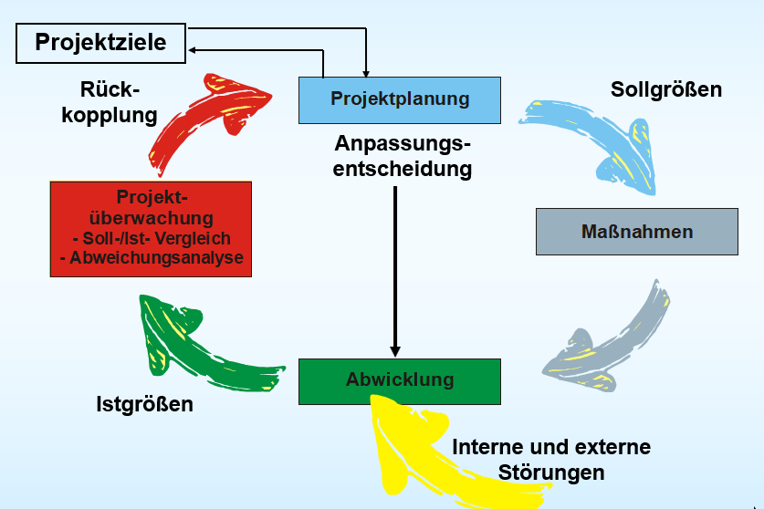

# Wie kann die grundsätzliche Aufgabe der Risikoanalyse beschrieben werden?

Den Projekterfolg gefährdende Faktoren
-> identifizieren
-> bewerten
-> Gegenmaßnahmen planen
-> für Risiko-Eintrittsfall vorzubereiten

# Beschreibe eine Risikomatrix (Zeichnung allein genügt nicht)?  Wie entsteht sie?

Auf der x-Achse wird in einem Koordinatensystem die Schadenshöhe eingezeichnet.
Auf der y-Achse steht die Eintrittswahrscheinlichkeit
Im Diagramm sind die Risiken in Abhängigkeit ihrer Eintrittswahrscheinlichkeiten und Auswirkungen bzw. Schadensausmaße verteilt, sodass Sie die gravierendsten auf einen Blick ermitteln können.

Sie entsteht durch Aufnahme von Date (Fragebogen, Checkliste, Riskioanalyse-Workshop)

[Quelle](https://www.microtool.de/wissen-online/was-ist-eine-risikomatrix/)

# Zähle mögliche Risikokategorien auf.

* Markt- und Branchenrisiken

* Management-Riskien

* Produktrisiken

* Prozessrisiken

* Personalrisiken

* Finanzielle- /rechtliche Risiken

* Projekthistorie

# Was ist die Gefahr des zu frühen Einsatzes von Checklisten, insbes. beim Finden von möglichen Projektrisiken?

Es besteht die Gefahr, projektspezifische Risiken zu übersehen

# Welche bekannten Modelle (wie z. B. CMMI) enthalten hilfreiche „Best Practice“ - Tipps zum Risiko-Management? (5 = volle Punktezahl, CMMI zählt natürlich nicht mehr mit)

* BOOTSTRAP
* SPICE/ISO 15504
* PMI PMBOK
* APM
* COBIT
* SEI
* CCTA
* DriveSPI

# Wenn wir alle Risiken gefunden und untersucht haben – welche Gefahren birgt so ein schwarz sehen?

Das Risken vermiden werden und somit Chancen ungenuzt bleiben

# „Denke positiv, lasse negative Gedanken erst gar nicht aufkommen!“ Welche Gefahren  birgt so eine „Rosa Brille“?

Die Realität aus den Augen verlieren/ Tatsachen aus den Augen verlieren

# Welche Tipps bezüglich Risikomanagement gibt uns Mr. Tompkins (aus DeMarko`s  „Der Termin“)

* Chancen und Risiken sind Zwillinge: Wo keine Risiken, dort keine Chancen
* Ziel ist daher NICHT die Risikovermeidung, denn dann  bleiben Chancen ungenutzt
* „Antizipieren Sie für jedes Risiko das allererste Symptom, mit dem es sich vermutlich ankündigen wird“ 
* „Ernennen Sie einen Risikobeauftragten, einen Mitarbeiter, den Sie von der „Das-Schaffen-wir-Haltung entbinden“ -> Realität geht vor „Rosa Brille“
* „Richten Sie zwanglose (vielleicht sogar anonyme) Kanäle ein, über die schlechte Nachrichten bis in die höchste Hierarchie-Ebenen hinauf kommuniziert werden können.“

# Beschreibe den Kreislauf des Projektcontrollings

Proektplanung entsteht in Verbindung mit Projektziele.
Durch Sollgrößen der Projektplanung entstehen Maßnahmen.
Aus diesen und Interenen wie auch externen Störungen entsteht die Abwicklung.
Die Ist-Größen entstehen durch die Abwicklung. 
Die Projektüberwachung für soll-/ist- Vergleich durch und benutzt eine Abweichungsanalyse. 
Aus der Projektüberwachung kann eine Rückkopplung zur Projektplanung entstehen.
Außerdem kann die Projektplanung Anpassungsentscheidungen treffen.

# Welche Gefahr besteht, wenn die Projektüberwachung zu spät einsetzt?

Es entsteht ein unkontrollierter Projektverlauf da man Maßnahmen nicht rechtzeitig setzen kann.

# Nenne die Voraussetzungen, die für ein frühzeitiges Erkennen von Planabweichungen erforderlich sind?

1. fundierte Planung als Vergleichsbasis
2. Terminkotnrolle: Rückmeldewesen
3. Aufwand + Kosten: Stundenkontierung
4. Ermittlung des "Arbeitswertes"
5. Begleitende Qualitätssicherung

# Was ist eine Leistungsgröße?

* Maximierung wird angestrebt
* Funktionsumfang(Quantität)
* Qualität

> analog Auto: Motorleiistung, Höchstgeschwindikgeit, Beschleunigung, Kofferraumvolumen, Tankinhalt

# a) Was ist eine Lastgröße?  b) Warum nennt man sie so?  c) Nenne Beispiele von Lastgrößen  d) Damit Lastgrößen und Leistungsgrößen leichter vergleichbar sind, wird ein mathematischer „Trick“ angewendet – wie zeigt sich dieser in der Formel für Lastgrößen?

**a)**

Kriterium, welches das Projekt erschwert

**b)**

Da sie das Projekt und dessen Erfolg belasten

**c)**
* Termin/Dauer
* Aufwand
* Kosten

**d)**
PTLast = [2 - (YV`Ist / YPlan)]*100 

# Was versteht man unter Termintreue?

**Termintreue für TeilProjekt**

TTTeilprojekt  =  (TPlan – TVerzug) / TPlan * 100

**Termintreue für Gesamtprojekt**

TTGesamtprojekt = sum(TTTeilprojekt)/Anzahl der Teilprojekte
Tverzug = Voraussichtliche Dauer - Tplan

# Wozu dient die Meilenstein-Trendanalyse?

 Mithilfe einer Meilenstein-Trendanalyse (Diagramm mit Planungszeitraum auf x-Achse und Berichtszeitraum auf y-Achse) kann man das zu einem bestimmten Zeitpunkt geschätze Fertigungsstellungsdatum eines Meilensteines sehen.

Jede Abweichung vom horizontalen Verlauf ist eine Abweichung von der ursprünglichen Planung, d. h. es liegt ein Verzug oder ein Vorsprung vor.

# Was versteht man unter dem „90 % fertig – Syndrom“? Welche Auswirkungen hat dies auf das Projektcontrolling?

Subjektive Einschätzung der Fertigstellung

Man schätzt die Fertigungsstellungsdauer kürzer ein als sie letztendlich ist

# Was versteht man unter Bestellwertfortschreibung? Welchen Nutzen hat dieser Ansatz?

Man addiert den Bestellwert zu den Ist-Kosten. Ohne dieser Methode täuschen bis zu Rechnungseingang zu niedrigen Betrag an

---

# a) Wozu dient die Meilenstein- Trendanalyse? b) Analysiere folgenden Verlauf: (kein Verlauf ist als normal anzunehmen, 1-2-3 sind abhängig) Was könnte im Projektablauf passiert sein?

	
# a) Wozu dient die Meilenstein- Trendanalyse? b) Analysiere folgenden Verlauf: (kein Verlauf ist als normal anzunehmen, 1-2-3 sind abhängig) Was könnte im Projektablauf passiert sein?
	
# a) Wozu dient die Meilenstein- Trendanalyse? b) Analysiere folgenden Verlauf (Gesamtsicht!) (kein Verlauf ist als normal anzunehmen, 1-2-3 sind abhängig) Was könnte im Projektablauf passiert sein?

---

# Kosten-Kontrolle: Wo liegen die „Fallen“, wenn die Ist-Daten mit einem linearen Plandaten-Verlauf verglichen werden? Wie kann man diese Fehleinschätzungen bestmöglich vermeiden?

Meist fallen Kosten vermehrt gegen Ende an
Am Anfang zu positive Sicht - führt zu leichtfertiger Kostensteigerung

Plankorrigierte: Mit einer laufenden Restaufwandskorrektur + Netzplanbasis jedoch ist dieser weg sehr aufwändig aufgrund ständiger Restkostenschätzungen.

# Beschreibe die Problematik der Feststellung des Fertigstellungsgrades. Gibt es Möglichkeiten, diese Problematiken zu verkleinern?

---

XXa)  1 P:  Was versteht man unter dem Begriff „Earned Value“?
XXb)  1 P:  Wie groß ist der Zeit [verzug|vorsprung] zum Zeitpunkt Z1: 
      ca. _____ Wochen   (Bitte auch im Diagramm einzeichnen)  
XXc)  1 P:  Wie groß ist der Zeit [verzug|vorsprung] zum Zeitpunkt Z2: 
      ca. _____ Wochen   (Bitte auch im Diagramm einzeichnen)     
XXd)  6 P:  Analysieren Sie folgende Earned-Value-Darstellung (KEINE einfache Kurvenbeschreibung, sondern mögliche schlüssige Gründe, die zu so einem Verlauf  geführt haben könnten)
XXe)   1 P Was heißt BCWS in Langform und wie lautet die neue Abkürzung und Langform von BCWS?  …..           1 P Wie lautet die neue Abkürzung und Langform von ACWP?  …..  
            1 P Wie lautet die neue Abkürzung und Langform von BCWP?  …..  

XXa)  1 P:  Was versteht man unter dem Begriff „Earned Value“?
XXb)  1 P:  Wie groß ist der Zeit [verzug|vorsprung] zum Zeitpunkt Z1: 
      ca. _____ Wochen   (Bitte auch im Diagramm einzeichnen)  
XXc)  1 P:  Wie groß ist der Zeit [verzug|vorsprung] zum Zeitpunkt Z2: 
      ca. _____ Wochen   (Bitte auch im Diagramm einzeichnen)     
XXd)  6 P:  Analysieren Sie folgende Earned-Value-Darstellung (KEINE einfache Kurvenbeschreibung, sondern mögliche schlüssige Gründe, die zu so einem Verlauf  geführt haben könnten)
XXe)   1 P Was heißt BCWS in Langform und wie lautet die neue Abkürzung und Langform von BCWS?  …..                  1 P Wie lautet die neue Abkürzung und Langform von ACWP?  …..  
            1 P Wie lautet die neue Abkürzung und Langform von BCWP?  …..  
 
XXa)  1 P:  Was versteht man unter dem Begriff „Earned Value“?
XXb)  1 P:  Wie groß ist der Zeit [verzug|vorsprung] zum Zeitpunkt Z1: 
      ca. _____ Wochen   (Bitte auch im Diagramm einzeichnen)  
XXc)  1 P:  Wie groß ist der Zeit [verzug|vorsprung] zum Zeitpunkt Z2: 
      ca. _____ Wochen   (Bitte auch im Diagramm einzeichnen)     
XXd)  6 P:  Analysieren Sie folgende Earned-Value-Darstellung (KEINE einfache Kurvenbeschreibung, sondern mögliche schlüssige Gründe, die zu so einem Verlauf  geführt haben könnten)
XXe)   1 P Was heißt BCWS in Langform und wie lautet die neue Abkürzung und Langform von BCWS?  …..                  1 P Wie lautet die neue Abkürzung und Langform von ACWP?  …..  
            1 P Wie lautet die neue Abkürzung und Langform von BCWP?  …..  

XXa)  1 P:  Was versteht man unter dem Begriff „Earned Value“?
XXb)  1 P:  Wie groß ist der Zeit [verzug|vorsprung] zum Zeitpunkt Z1: 
      ca. _____ Wochen   (Bitte auch im Diagramm einzeichnen)  
XXc)  1 P:  Wie groß ist der Zeit [verzug|vorsprung] zum Zeitpunkt Z2: 
      ca. _____ Wochen   (Bitte auch im Diagramm einzeichnen) 
XXc)  1 P:  Wie groß ist der Zeit [verzug|vorsprung] zum Zeitpunkt Z3: 
      ca. _____ Wochen   (Bitte auch im Diagramm einzeichnen)     
XXc)  1 P:  Wie groß ist der Zeit [verzug|vorsprung] zum Zeitpunkt Z4: 
      ca. _____ Wochen   (Bitte auch im Diagramm einzeichnen)     
XXd)  6 P:  Analysieren Sie folgende Earned-Value-Darstellung (KEINE einfache Kurvenbeschreibung, sondern mögliche schlüssige Gründe, die zu so einem Verlauf  geführt haben könnten)
XXe)   1 P Was heißt BCWS in Langform und wie lautet die neue Abkürzung und Langform von BCWS?  …..                  1 P Wie lautet die neue Abkürzung und Langform von ACWP?  …..  
            1 P Wie lautet die neue Abkürzung und Langform von BCWP?  …..  

XXa)  1 P:  Was versteht man unter dem Begriff „Earned Value“?
XXb)  1 P:  Wie groß ist der Zeit [verzug|vorsprung] zum Zeitpunkt Z1: 
      ca. _____ Wochen   (Bitte auch im Diagramm einzeichnen)  
XXc)  1 P:  Wie groß ist der Zeit [verzug|vorsprung] zum Zeitpunkt Z2: 
      ca. _____ Wochen   (Bitte auch im Diagramm einzeichnen)     
XXd)  6 P:  Analysieren Sie folgende Earned-Value-Darstellung (KEINE einfache Kurvenbeschreibung, sondern mögliche schlüssige Gründe, die zu so einem Verlauf  geführt haben könnten)
XXe)   1 P Was heißt BCWS ins Langform und wie lautet die neue Abkürzung und Langform von BCWS?  …..                  1 P Wie lautet die neue Abkürzung und Langform von ACWP?  …..  
            1 P Wie lautet die neue Abkürzung und Langform von BCWP?  …..  

# Welche der folgenden Antworten sind richtig? 
Unter Earned Value versteht man:

a)	Was man am Projekt verdient, d.h. das was man als Auftraggeber bekommt minus das was in das Projekt investiert hat

b)	Die nach Plankosten bewerteten abgeschlossenen Arbeiten

c)	Die nach Plankosten bewerteten noch durchzuführenden Arbeiten

d)	Die nach Istkosten bewerteten abgeschlossenen Arbeiten

e)	Die nach Istkosten bewerteten noch durchzuführenden Arbeiten

f)	Plankosten minus Istkosten

g)	Was man am Projekt verdient, d.h. das was man als Auftragnehmer bekommt minus das was man  in das Projekt investiert  hat

**b)**

# Was versteht man unter „Earned value“? Analysiere folgenden Verlauf einer Earned-Value-Kurve: Wie ist der Projektstatus Ende September zu beurteilen? Wie hoch ist ca. der zeitliche Verzug? Was ist sonst noch aus den Kurvenverläufen zu ersehen? 

geplante Kosten der tatsächlich erbrachten Arbeitsleistung (oder: erzielte Wertschöpfung zu Plankosten)

# Was ist ein PM-Handbuch (PM-Leitfaden)? 

* Enthält Standards für die Projektarbeit
* Wird vom Projektteam er- bzw. überarbeitet
* Hilfreich für die Projektarbeit
* Unterschrieben von der Unternehmensführung

# Was ist der Inhalt eines PM-Handbuchs bzw. PM-Leitfadens (Muss und Wunsch)?

**muss**
* Die Beschreibung der Projektorganisation
* Die Beschreibung des Projektablaufs
* Die Methoden des Projektmanagements
* Die Regelung des Informationswesens
* Die Dokumentation

**wunsch**
* Ein Vorwort der Unternehmensleitung
* Definitionen
* Eine Beschreibung der Arbeitshilfen
* Die Verantwortlichkeit für die Pflege des PM-Leitfadens

# Was ist der Unterschied zwischen einem a) Projektmanagement-Handbuch bzw. PM-Leitfaden und einem b) Projekthandbuch?

Der PM-Leitfaden ist ein projektunabhängiges, übergeordnetes Hilfswerk, das zur Standardisierung der PM-Arbeit dienen soll.

Das Projekthandbuch ist die gesammelte Projektdokumentation spezifisch für ein Projekt

Aus dem Projektmanagement-Leitfaden leiten sich Projekthandbücher ab.

# Was ist die Aufgabe der Dokumenten- und Berichterstattungsplanung?

Das Ziel der Dokumenten- und Berichtserstattungsplanung ist ein stets aktueller Überblick und somit klares, frühzeitiges Erkennen von Problemen und Risiken.

# Was sind die Kerninhalte der Phase Projektabschluss?

1. Produktabnahme
2. Abschlussanalyse
3. Erfahrungssicherung
4. Projektauflösung

Ergebnisse:
      * Abnahmeprotokolle
      * Nachkalkulation
      * Kennzahlen, Berichte
      * Abschlussberichte
      * Personalüberleitung

# Beschreibe die Begriffe Übergabeprotokoll und Übernahmeprotokoll

**Übergabeprotokoll**
Das Übergabeprotokoll beinhaltet die Beschreibung des Übergabegegenstandes(Software, Dokumentation, Handbücher)

**Übernahmeprotokoll**
Das Übernahmeprotkoll beinhaltet die Basis für eventuelle Nachforderungen durch den Auftraggeber(genaues Festhalten erforderliche Restleistungen). 

# Was beschreibt das M-Modell?

Sicht auf ein projektorientiert geführtes Unternehmen und die Funktionen, die von PM-Software unterstützt werden sollen
